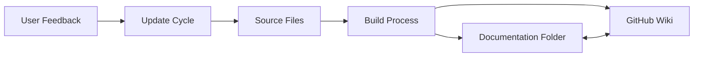

# Product Requirements Document: GitHub Wiki & Documentation Revamp Initiative

**Product**: Claude Code Skills & Agents Factory Documentation System
**Version**: 1.0.0
**Date**: 2025-10-24
**Status**: Draft
**Author**: rr-prd-specialist

---

## Executive Summary

This PRD outlines a comprehensive revamp of the Claude Code Skills & Agents Factory documentation ecosystem, transforming it from a functional reference repository into a world-class resource hub that drives adoption, accelerates learning, and showcases the power of Claude AI capabilities. The initiative encompasses GitHub Wiki creation, documentation restructuring, workflow automation, and strategic promotion to establish this as the premier resource for Claude Skills and Agents development.

---

## 1. Product Vision & Strategy

### 1.1 Strategic Vision

**Vision Statement**: Become the definitive, go-to resource for developers and organizations looking to leverage Claude AI's Skills and Agents capabilities, providing comprehensive documentation that accelerates time-to-value from days to hours.

### 1.2 Target Audiences

| Audience | Primary Needs | Key Value Proposition |
|----------|--------------|----------------------|
| **Individual Developers** | Quick start, examples, templates | Generate production-ready skills in <30 minutes |
| **Enterprise Teams** | Scalability, security, best practices | Enterprise-grade patterns with 4-layer security |
| **Content Creators** | Content research, trend analysis, prompts | 69 presets across 15 domains, multi-platform analysis |
| **AI Enthusiasts** | Learning resources, experimentation | Complete learning path from basics to advanced |
| **DevOps Engineers** | Automation, CI/CD, deployment | GitHub workflows, automated testing, deployment guides |
| **Product Managers** | Business value, use cases, ROI | Clear business cases, success metrics, case studies |

### 1.3 Competitive Positioning

| Competitor | Our Advantage |
|------------|--------------|
| **Generic AI Tools** | Purpose-built for Claude, optimized patterns |
| **Custom Development** | 10x faster with pre-built templates and examples |
| **Other AI Frameworks** | Native Claude integration, Anthropic best practices |
| **Manual Processes** | Full automation with GitHub workflows |

### 1.4 Success Metrics

- **Adoption**: 1000+ GitHub stars within 3 months
- **Usage**: 500+ forks/clones per month
- **Engagement**: 50+ community contributions
- **Documentation**: <5 minute time-to-first-skill
- **Quality**: 95% user satisfaction rating

---

## 2. GitHub Wiki Structure

### 2.1 Wiki Page Hierarchy

```
Home (Landing Page)
├── Getting Started
│   ├── Quick Start Guide
│   ├── Installation & Setup
│   ├── Your First Skill
│   └── Your First Agent
├── Concepts
│   ├── Understanding Claude Skills
│   ├── Understanding Claude Agents
│   ├── Skills vs Agents Comparison
│   └── Architecture Patterns
├── Tutorials
│   ├── Basic
│   │   ├── Creating a Simple Skill
│   │   ├── Creating a Simple Agent
│   │   └── Using Templates
│   ├── Intermediate
│   │   ├── Multi-file Skills
│   │   ├── Agent Orchestration
│   │   └── Custom Workflows
│   └── Advanced
│       ├── Enterprise Integration
│       ├── Security Best Practices
│       └── Performance Optimization
├── Reference
│   ├── Skills Catalog
│   │   ├── Financial Analysis
│   │   ├── Content Research
│   │   ├── AWS Architecture
│   │   ├── Microsoft 365
│   │   ├── Psychology Advisor
│   │   └── Prompt Engineering
│   ├── Agents Catalog
│   │   ├── Development Agents
│   │   ├── Testing Agents
│   │   ├── Documentation Agents
│   │   └── Operations Agents
│   ├── Templates
│   │   ├── Skills Factory Template
│   │   └── Agents Factory Template
│   └── API Reference
├── Use Cases
│   ├── By Industry
│   │   ├── Finance & Banking
│   │   ├── Healthcare
│   │   ├── E-commerce
│   │   ├── SaaS Products
│   │   └── Content Creation
│   └── By Role
│       ├── Developers
│       ├── Product Managers
│       ├── Content Creators
│       ├── DevOps Engineers
│       └── Business Analysts
├── Best Practices
│   ├── Skill Development Guidelines
│   ├── Agent Design Patterns
│   ├── Security Considerations
│   ├── Performance Optimization
│   └── Testing Strategies
├── Automation
│   ├── GitHub Workflows
│   ├── CI/CD Integration
│   ├── Automated Testing
│   └── Deployment Strategies
└── Community
    ├── Contributing Guide
    ├── Code of Conduct
    ├── Showcase
    ├── FAQ
    └── Support & Resources
```

### 2.2 Key Wiki Pages Content

#### Home Page
- **Hero Section**: Value proposition with visual diagram
- **Quick Links**: Most common actions (Generate Skill, Generate Agent, View Examples)
- **Latest Updates**: Recent additions and improvements
- **Success Stories**: Featured implementations
- **Getting Started CTA**: Clear next steps

#### Quick Start Guide
- **5-Minute Setup**: Fastest path to first skill
- **Prerequisites Checklist**: What you need
- **Step-by-Step Instructions**: With screenshots
- **Verification Steps**: Confirm everything works
- **Next Steps**: Where to go from here

#### Skills Catalog
- **Grid Layout**: Visual cards for each skill
- **Key Information**: Size, complexity, use cases
- **Live Demos**: Interactive examples where possible
- **Download Links**: Direct access to ZIP files
- **Implementation Guides**: Detailed usage instructions

#### Use Cases by Industry
- **Real-World Scenarios**: Concrete business problems
- **Solution Architecture**: How skills/agents solve them
- **ROI Calculations**: Time/cost savings
- **Implementation Timeline**: Realistic expectations
- **Success Metrics**: How to measure impact

### 2.3 Navigation Strategy

- **Persistent Sidebar**: Always-visible navigation tree
- **Breadcrumbs**: Clear location context
- **Search Functionality**: Full-text search across all pages
- **Related Links**: Context-aware suggestions
- **Quick Actions**: Floating action buttons for common tasks

### 2.4 Cross-Linking Strategy

- **Bidirectional Links**: Wiki ↔ Repository
- **Deep Links**: Direct links to specific sections
- **Version Tags**: Link to specific releases
- **Code References**: Link to actual implementation files
- **External Resources**: Anthropic docs, community resources

---

## 3. Documentation Folder Revamp

### 3.1 Proposed Structure

```
documentation/
├── foundation/                    # Strategic documents
│   ├── mission.md                # Project mission and vision
│   ├── prd.md                    # This PRD document
│   ├── architecture.md           # System architecture overview
│   └── roadmap.md                # Development roadmap
├── guides/                        # User guides and tutorials
│   ├── quick-start/              # Getting started quickly
│   │   ├── installation.md
│   │   ├── first-skill.md
│   │   └── first-agent.md
│   ├── tutorials/                # Step-by-step tutorials
│   │   ├── basic/
│   │   ├── intermediate/
│   │   └── advanced/
│   └── best-practices/           # Best practices and patterns
│       ├── skill-development.md
│       ├── agent-design.md
│       └── security.md
├── reference/                     # Technical reference
│   ├── api/                      # API documentation
│   ├── skills/                   # Skills reference
│   ├── agents/                   # Agents reference
│   └── workflows/                # Workflow documentation
├── templates/                     # [EXISTING] Factory templates
│   ├── SKILLS_FACTORY_PROMPT.md
│   └── AGENTS_FACTORY_PROMPT.md
├── examples/                      # Example implementations
│   ├── skills/                   # Example skills
│   ├── agents/                   # Example agents
│   └── workflows/                # Example workflows
├── use-cases/                     # Real-world use cases
│   ├── by-industry/              # Industry-specific
│   └── by-role/                  # Role-specific
├── operations/                    # [EXISTING] Operational docs
│   ├── maintenance/              # Maintenance guides
│   ├── deployment/               # Deployment guides
│   └── monitoring/               # Monitoring guides
└── community/                     # Community resources
    ├── contributing.md           # Contribution guidelines
    ├── showcase.md               # Community showcases
    └── resources.md              # External resources
```

### 3.2 Content Distribution

| Content Type | Wiki Location | Docs Folder | Repository |
|-------------|--------------|-------------|------------|
| Getting Started | ✅ Full guide | Quick reference | README link |
| Tutorials | ✅ Interactive | Detailed steps | - |
| API Reference | Link only | ✅ Full docs | - |
| Templates | Link + preview | ✅ Source files | - |
| Examples | Showcase | - | ✅ Full code |
| Use Cases | ✅ Stories | Technical details | - |
| Best Practices | ✅ Guidelines | Implementation | - |

### 3.3 Living Document Strategy

#### Update Triggers
- **Code Changes**: Auto-update when skills/agents modified
- **New Features**: Document within same PR
- **User Feedback**: Weekly review and update cycle
- **Version Releases**: Comprehensive review per release

#### Documentation Standards
- **Format**: Markdown with YAML frontmatter
- **Structure**: Consistent headers and sections
- **Examples**: Every concept includes example
- **Versioning**: Clear version tags and changelog
- **Cross-References**: Liberal use of internal links

#### Quality Gates
- **PR Requirements**: No merge without docs update
- **Review Process**: Technical writer review for major changes
- **Automated Checks**: Markdown linting, link validation
- **User Testing**: Beta users validate documentation

---

## 4. Workflow Design

### 4.1 Wiki-Documentation Synchronization



### 4.2 Content Workflows

#### New Skill/Agent Addition
1. Developer creates skill/agent
2. Auto-generate documentation stub
3. Developer fills documentation
4. PR includes both code and docs
5. On merge: Update Wiki catalog
6. Weekly: Feature in showcase

#### Documentation Update
1. Issue/PR triggers update need
2. Bot creates documentation task
3. Update documentation files
4. Review and approve
5. Auto-sync to Wiki
6. Notify subscribers

### 4.3 Automation Opportunities

| Task | Automation Solution | Frequency |
|------|-------------------|-----------|
| Wiki Sync | GitHub Action | On merge |
| Link Validation | CI/CD check | Every PR |
| Catalog Update | Script | Daily |
| Metrics Collection | Analytics | Real-time |
| Newsletter | Email automation | Weekly |
| Changelog | Auto-generation | Per release |

### 4.4 Version Control Strategy

- **Main Branch**: Always deployable documentation
- **Feature Branches**: Documentation updates with code
- **Release Tags**: Snapshot documentation versions
- **Wiki Versions**: Mirror repository tags
- **Rollback Process**: Easy reversion to previous versions

---

## 5. Promotion Strategy

### 5.1 Marketing Content

#### Launch Materials
- **Blog Post**: "Introducing Claude Code Skills Factory"
- **Video Demo**: 5-minute overview and quick start
- **Twitter Thread**: Key features and benefits
- **LinkedIn Article**: Enterprise value proposition
- **Dev.to Tutorial**: Step-by-step skill creation

#### Ongoing Content
- **Weekly Skill Spotlight**: Feature new skill/agent
- **Use Case Studies**: Real implementation stories
- **Tutorial Series**: Progressive learning path
- **Community Highlights**: Showcase contributions
- **Performance Reports**: Metrics and improvements

### 5.2 Distribution Channels

| Channel | Content Type | Frequency | Owner |
|---------|-------------|-----------|--------|
| GitHub | Releases, README | Continuous | Maintainers |
| Twitter/X | Updates, tips | 2-3x/week | Community Manager |
| LinkedIn | Articles, cases | Weekly | Product Team |
| Dev.to | Tutorials | Bi-weekly | DevRel |
| YouTube | Demos, tutorials | Monthly | Content Team |
| Newsletter | Digest, features | Weekly | Marketing |
| Reddit | Discussions | As needed | Community |
| Discord | Support, chat | Daily | Community |

### 5.3 Key Messaging

#### Primary Message
"Generate production-ready Claude Skills and Agents in minutes, not days"

#### Supporting Messages
- "10x faster than custom development"
- "Enterprise-grade security and patterns"
- "69 presets across 15 professional domains"
- "Complete GitHub automation included"
- "Active community and support"

### 5.4 Community Building

#### Engagement Strategies
- **Contributor Recognition**: Hall of fame, badges
- **Skill Contests**: Monthly challenges
- **Office Hours**: Weekly Q&A sessions
- **Ambassador Program**: Power user advocates
- **Feedback Loops**: User input shapes roadmap

#### Community Platforms
- **GitHub Discussions**: Primary forum
- **Discord Server**: Real-time chat
- **Stack Overflow Tag**: Technical Q&A
- **Reddit Subreddit**: Broader discussions
- **Slack Workspace**: Enterprise users

---

## 6. Implementation Roadmap

### 6.1 Phase 1: Quick Wins (Week 1-2)

#### Objectives
- Establish basic Wiki structure
- Improve existing README
- Create landing experience

#### Deliverables
- [ ] Wiki home page with navigation
- [ ] Quick Start guide (5-minute setup)
- [ ] Enhanced README with TOC
- [ ] Skills/Agents catalog pages
- [ ] Basic getting started flow

#### Success Criteria
- Wiki accessible and navigable
- First-time users can create skill in <10 minutes
- Clear value proposition communicated

### 6.2 Phase 2: Core Documentation (Week 3-6)

#### Objectives
- Complete Wiki population
- Restructure documentation folder
- Implement automation

#### Deliverables
- [ ] All Wiki sections populated
- [ ] Documentation folder restructured
- [ ] Automation workflows active
- [ ] Tutorial series complete
- [ ] Use case library built

#### Success Criteria
- 100% documentation coverage
- Automated sync working
- User satisfaction >80%

### 6.3 Phase 3: Promotion & Growth (Week 7-12)

#### Objectives
- Launch marketing campaign
- Build community
- Drive adoption

#### Deliverables
- [ ] Launch blog post published
- [ ] Video content created
- [ ] Social media campaign active
- [ ] Community platforms established
- [ ] Metrics dashboard operational

#### Success Criteria
- 1000+ GitHub stars
- 100+ Discord members
- 50+ community contributions
- 10+ use case studies

### 6.4 Timeline Overview

```
Week 1-2:   [████████] Quick Wins
Week 3-4:   [████████████] Core Documentation Build
Week 5-6:   [████████████] Documentation Completion
Week 7-8:   [████████████] Launch Preparation
Week 9-10:  [████████████] Marketing Push
Week 11-12: [████████████] Community Building
Ongoing:    [░░░░░░░░░░░░] Maintenance & Growth
```

---

## 7. Maintenance Plan

### 7.1 Documentation Lifecycle

#### Review Cadence
- **Daily**: Automated link and format checks
- **Weekly**: Community feedback review
- **Monthly**: Comprehensive content audit
- **Quarterly**: Strategic alignment review
- **Annually**: Complete restructure evaluation

### 7.2 Ownership Matrix

| Area | Primary Owner | Backup | Review Frequency |
|------|--------------|--------|------------------|
| Wiki Home | Product Manager | Tech Lead | Weekly |
| Getting Started | DevRel | Tech Writer | Bi-weekly |
| Tutorials | Tech Writer | Senior Dev | Monthly |
| Reference Docs | Tech Lead | Senior Dev | Per release |
| Use Cases | Product Manager | Marketing | Monthly |
| Community | Community Manager | DevRel | Daily |

### 7.3 Quality Gates

#### Pre-Release Checks
- [ ] All new features documented
- [ ] Examples updated and tested
- [ ] Links validated
- [ ] Changelog updated
- [ ] Wiki synchronized

#### Post-Release Tasks
- [ ] Announcement published
- [ ] Community notified
- [ ] Metrics tracked
- [ ] Feedback collected
- [ ] Roadmap updated

### 7.4 Continuous Improvement

#### Feedback Channels
- GitHub Issues (documentation label)
- Wiki comments
- Discord #documentation
- User surveys (quarterly)
- Analytics data

#### Improvement Process
1. Collect feedback (continuous)
2. Prioritize improvements (weekly)
3. Implement changes (sprint-based)
4. Validate with users (before merge)
5. Deploy and monitor (automated)

---

## 8. Risk Mitigation

### 8.1 Identified Risks

| Risk | Likelihood | Impact | Mitigation |
|------|-----------|--------|------------|
| Documentation drift | Medium | High | Automated sync, PR requirements |
| Low adoption | Low | High | Marketing push, clear value prop |
| Maintenance burden | Medium | Medium | Automation, clear ownership |
| Technical complexity | Low | Medium | Progressive disclosure, tutorials |
| Community fragmentation | Low | Low | Central Discord, clear channels |

### 8.2 Contingency Plans

- **If adoption is low**: Increase marketing, simplify onboarding
- **If maintenance is overwhelming**: Recruit community maintainers
- **If documentation drifts**: Implement stricter gates, more automation
- **If users are confused**: Add more examples, video tutorials

---

## 9. Success Metrics & KPIs

### 9.1 Adoption Metrics

| Metric | Target (3 months) | Target (6 months) | Target (1 year) |
|--------|------------------|-------------------|-----------------|
| GitHub Stars | 1,000 | 2,500 | 5,000 |
| Forks | 200 | 500 | 1,000 |
| Wiki Views | 10,000/month | 25,000/month | 50,000/month |
| Active Users | 500 | 1,500 | 5,000 |

### 9.2 Quality Metrics

| Metric | Target | Measurement |
|--------|--------|-------------|
| Time to First Skill | <5 minutes | User testing |
| Documentation Coverage | 100% | Automated scan |
| User Satisfaction | >90% | Survey (NPS) |
| Issue Resolution Time | <48 hours | GitHub metrics |
| PR Documentation Rate | 100% | CI/CD check |

### 9.3 Community Metrics

| Metric | Target (3 months) | Measurement |
|--------|------------------|-------------|
| Discord Members | 100 | Platform stats |
| Community PRs | 50 | GitHub stats |
| Skill Submissions | 20 | Repository count |
| Use Case Studies | 10 | Documentation count |

---

## 10. Budget & Resources

### 10.1 Required Resources

| Resource | Allocation | Duration | Cost |
|----------|-----------|----------|------|
| Technical Writer | 0.5 FTE | 3 months | Contract/Internal |
| DevRel Engineer | 0.3 FTE | Ongoing | Internal |
| Community Manager | 0.2 FTE | Ongoing | Internal |
| Marketing Support | Project-based | 1 month | $5,000 |
| Infrastructure | GitHub, Discord | Ongoing | Free tier |

### 10.2 ROI Projection

- **Development Time Saved**: 1000 hours/month across users
- **Adoption Value**: $500,000 in avoided custom development
- **Community Value**: 50+ contributors = $200,000 equivalent
- **Brand Value**: Thought leadership in Claude ecosystem

---

## Appendix

### A. Related Documents
- [README.md](/Users/rezarezvani/projects/claude-code-skills-factory/README.md)
- [CLAUDE.md](/Users/rezarezvani/projects/claude-code-skills-factory/CLAUDE.md)
- [SKILLS_FACTORY_PROMPT.md](/Users/rezarezvani/projects/claude-code-skills-factory/documentation/templates/SKILLS_FACTORY_PROMPT.md)
- [AGENTS_FACTORY_PROMPT.md](/Users/rezarezvani/projects/claude-code-skills-factory/documentation/templates/AGENTS_FACTORY_PROMPT.md)

### B. Glossary
- **Skill**: Multi-file capability package for Claude
- **Agent**: Single-file specialized assistant
- **Factory**: Template system for generation
- **Wiki**: GitHub Wiki documentation system
- **PRD**: Product Requirements Document

### C. Version History
- v1.0.0 (2025-10-24): Initial PRD created

---

*End of Product Requirements Document*